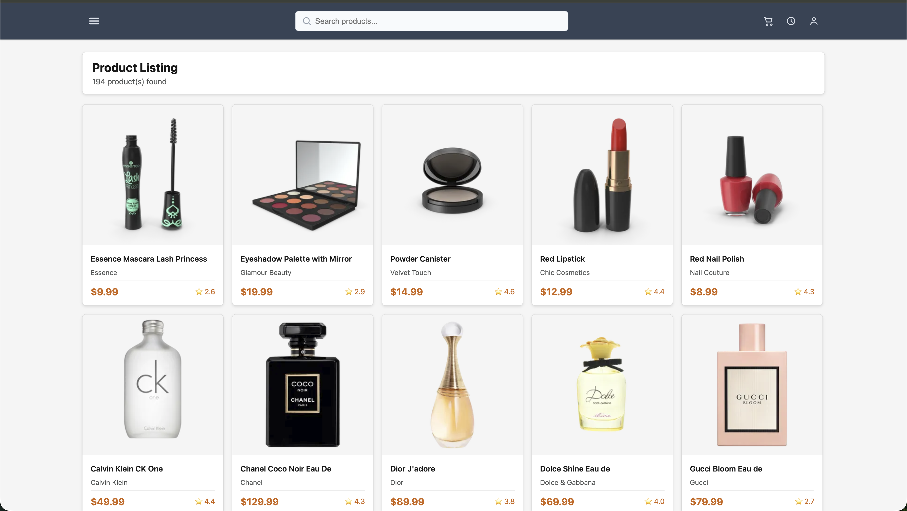
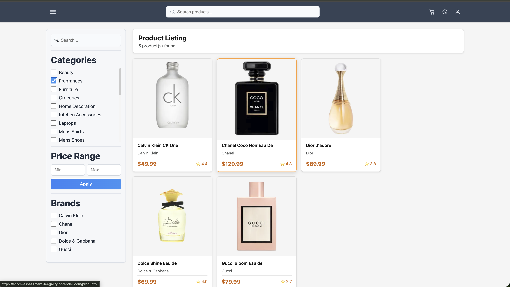
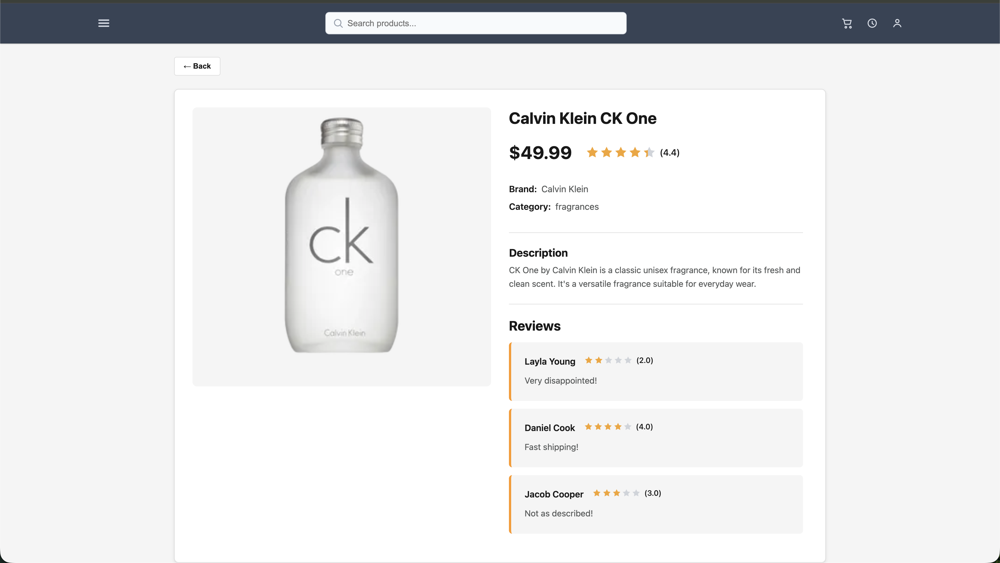

# Shakeb E-Commerce UI

A React + TypeScript e-commerce frontend that displays products from DummyJSON, with a filterable/paginated product listing page and a product detail page.

## Product Listing Screenshot



## Product Listing Screenshot (With Sidebar)




## Product Details Page Screenshot



## Product Images Gallery (Home Page)

| Essence Mascara Lash Princess | Eyeshadow Palette with Mirror | Powder Canister | Red Lipstick |
| --- | --- | --- | --- |
|  |  |  |  |

| Red Nail Polish | Calvin Klein CK One | Chanel Coco Noir Eau De | Dior J'adore |
| --- | --- | --- | --- |
|  |  |  |  |

| Dolce Shine Eau de | Gucci Bloom Eau de | Annibale Colombo Bed | Annibale Colombo Sofa |
| --- | --- | --- | --- |
|  |  |  |  |

## Tech Stack

- React 19
- TypeScript
- Vite 8
- React Router DOM 6 (browser routing)
- Redux Toolkit
- RTK Query (data fetching and caching)
- React Redux
- ESLint 10 + TypeScript ESLint

## Features and Functionalities

### 1) Product Listing (Home Page)

- Fetches product data from DummyJSON API.
- Shows products in a responsive grid with:
  - image
  - title
  - brand
  - price
  - rating
- Displays total result count.
- Client-side pagination for product cards.
- Handles loading, error, and empty states.

### 2) Filters and Search

- Toggleable sidebar filters panel.
- Category filtering (fetched dynamically from API).
- Brand multi-select filtering.
- Min/Max price filtering.
- Global product search from header (debounced).
- Combined filtering logic (search + category + brand + price).
- Automatic page reset to page 1 when filters change.

### 3) Product Detail Page

- Route-based product detail page: `/product/:id`.
- Fetches selected product by ID.
- Shows:
  - large product image
  - title
  - price
  - star rating component
  - brand and category metadata
  - description
- Displays customer reviews with review pagination.
- Back button to return to previous page.
- Handles invalid product ID and failed fetch states.

### 4) Reusable Shared UI Components

- `Header`
- `Layout`
- `LoadingState`
- `ErrorState`
- `EmptyState`
- `StarRating`

### 5) State Management

- Redux store with:
  - `productFilters` slice for UI filter state
  - RTK Query API slice for server data
- Centralized selectors for:
  - available brands
  - filtered products
  - paginated products
  - pagination metadata

### 6) API Integration

Uses DummyJSON endpoints:

- `GET /products`
- `GET /products/category/:category`
- `GET /products/:id`
- `GET /products/categories`

Includes category response normalization to handle multiple response shapes.

### 7) Input Safety and Data Handling

- Numeric sanitization for price inputs.
- Search normalization (trim/lowercase).
- Defensive parsing for min/max price values.

## Project Structure

```text
src/
  app/
    hooks.ts
    router.tsx
    store.ts
  features/
    products/
      api/
      components/
      lib/
      model/
      pages/
      store/
  shared/
    components/
    lib/
```

## Getting Started

### Prerequisites

- Node.js 18+
- npm

### Install dependencies

```bash
npm install
```

### Run in development

```bash
npm run dev
```

### Build for production

```bash
npm run build
```

### Preview production build

```bash
npm run preview
```

### Lint

```bash
npm run lint
```

## Notes

- Data source: [DummyJSON](https://dummyjson.com)
- The app is optimized for desktop and mobile with responsive CSS breakpoints.
